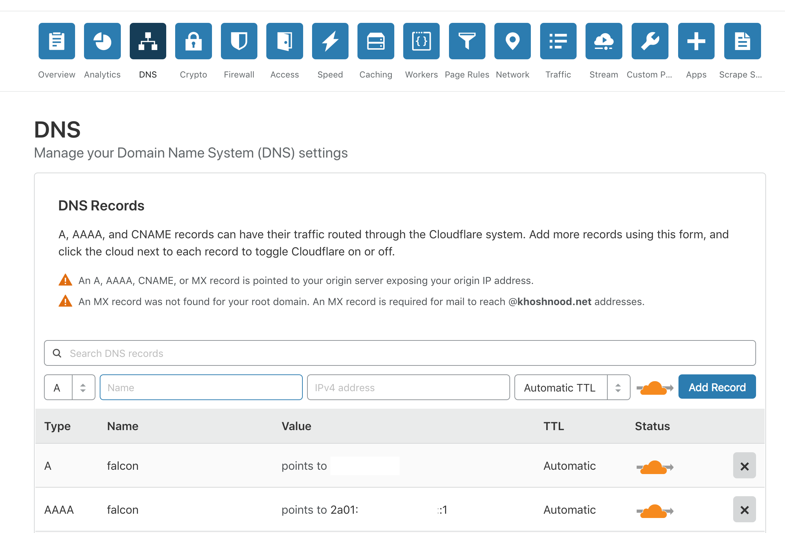

# Run Falcon Ruby app

These Ansible playbooks will run Falcon Ruby app with self-signed TLS/SSL key.

### Ansible setup
First of all, you have to [install Ansible](https://docs.ansible.com/ansible/latest/installation_guide/intro_installation.html) through package manager or pip and clone this repo:
``` bash
cd ~ && git clone https://github.com/amnkh/falcon.git
```
To run these playbooks, first edit `group_vars` file and enter your details like:
```
domain_fqdn_address: falcon.example.net
ubuntu_server_version: bionic
set_timezone: Asia/Tehran
```
Now create your hosts file in falcon root directory:
``` bash
cd ~/falcon && vim hosts
```
hosts:
```
[falcon]
falcon.example.net

[all:vars]
ansible_ssh_user=root
ansible_ssh_port=22

[falcon:vars]
ansible_ssh_host=192.168.1.10
```
Then change directory to falcon root directory and run:
``` bash
ansible-playbook  -i hosts main.yml
```
It will install prerequisites packages, Docker, pip, PostgreSQL and clones Ruby app and run it, then start a NGINX in docker as reverse proxy. For better security and performance, you can run it behind [Cloudflare](https://www.cloudflare.com/) CDN and WAF.

#### Here are some Cloudflare Configurations:

